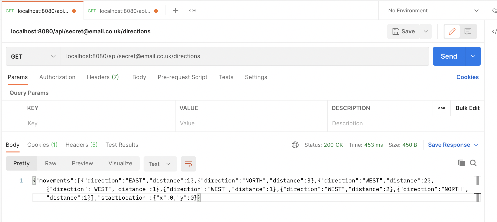
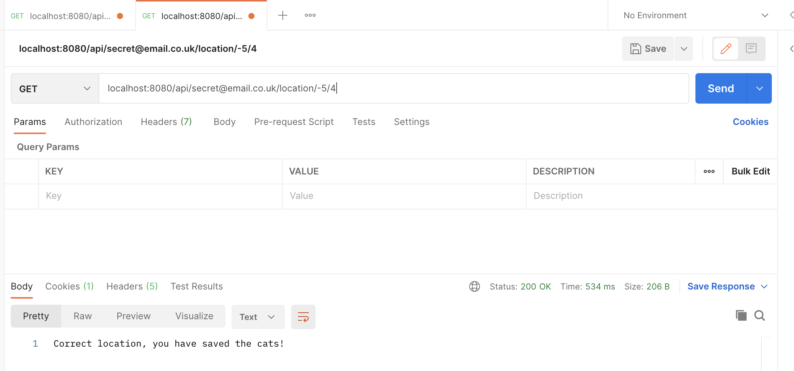

# Forensics API
The forensics-api is an application that the forensics team exposes to the detective squad to assist with the case of the witch who 
is kidnapping cats in the local area. The application provides them with two services.
1) Provides data of the previous movements of the witch
2) Validates a guess of the final location of the witch, where the detective squad are only allowed five guesses.

### Request validation
Each request must include an email address to prove that the individual making the request is authorized.
A list of authorized email address is stored in the `application.yml` file.

### Entry points
The api has two endpoints:
* `GET directions` - returns a json payload of recent movements of the witch with a starting point.
* `GET location` - allows the detective squad to guess the end location of the Witch and will validate if the guess is correct.
The detective squad will only be able to have 5 guesses of the witches final location.

### Testing
When running, we are ignoring running the tests in the graldew build due to technical issues when running unit tests on my IDE.

### Running locally
Run the script `./run-local.sh` to build a jar of the application and start running it locally. The application will be exposes on 
port `8080`
* Call directions endpoint `localhost:8080/api/{email}/directions`
* Call location endpoint `localhost:8080/api/{email}/location/{x}/{y}` 

See examples below of using Postman to call the directions and location endpoint with an expected response.

### Future developments
Rumors that the witch is recruiting additional witches to expand her operation of cat kidnapping. The forensics team would
like to allow more detective units from across the country to access the application. They have decided it would be best
to package the application into a container where the image can accessed through the Docker Hub. 

To build docker image, run script `./docker-build.sh`. This will build a docker image of the application locally and then
display all local docker images. Then apply the following commands to push to a remote repository for others to access:
* `docker login`
* `docker tag <image-id> <docker-username>/forensics-api`
* `docker push <docker-username>/forensics-api`
